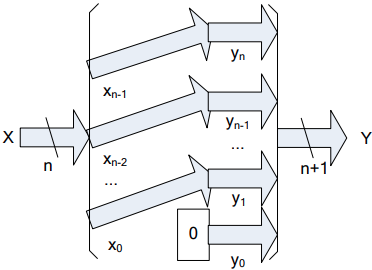
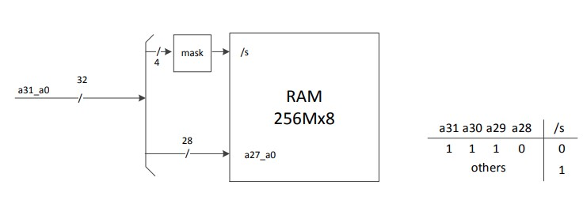
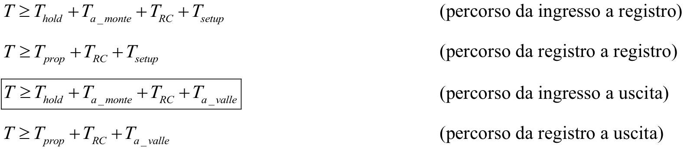
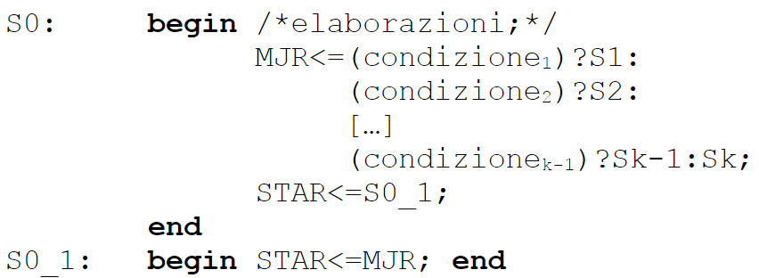
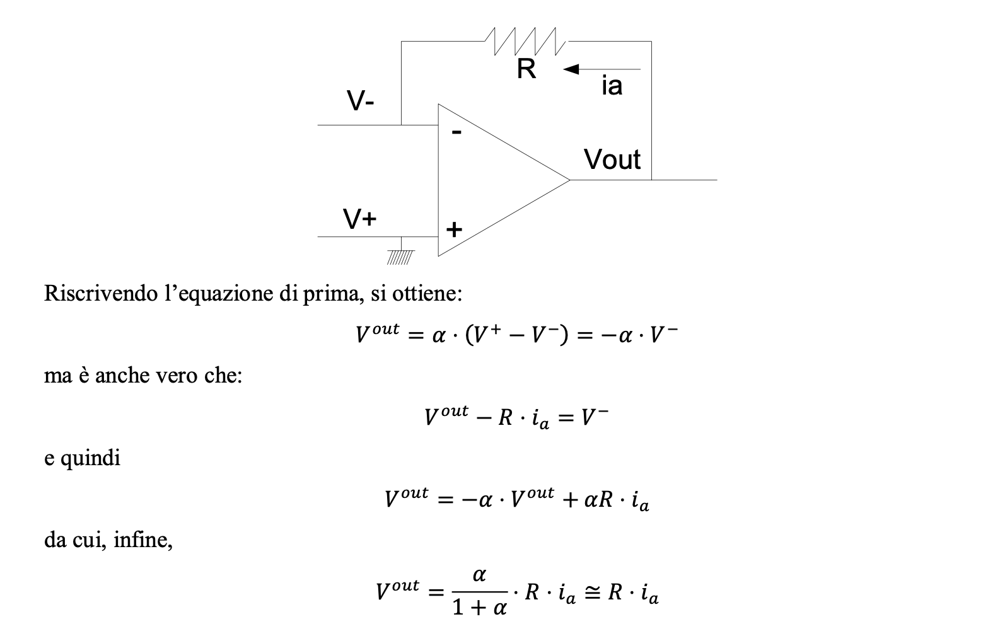

- [Porte logiche universali (NAND e NOR)](#porte-logiche-universali-nand-e-nor)
- [Reti combinatorie](#reti-combinatorie)
	- [Assioma](#assioma)
	- [Definizioni](#definizioni)
		- [Descrizione di una rete](#descrizione-di-una-rete)
		- [Sintesi di una rete](#sintesi-di-una-rete)
	- [Reti elementari interessanti](#reti-elementari-interessanti)
		- [Reti a più ingressi](#reti-a-più-ingressi)
		- [Invertitore](#invertitore)
		- [Elemento neutro](#elemento-neutro)
		- [Tri-state](#tri-state)
		- [Decoder](#decoder)
		- [Demultiplexer](#demultiplexer)
		- [Multiplexer](#multiplexer)
	- [Algebra di Boole](#algebra-di-boole)
		- [Complemento](#complemento)
		- [Prodotto logico (AND)](#prodotto-logico-and)
		- [Somma logica (OR)](#somma-logica-or)
		- [Proprietà](#proprietà)
		- [Teoremi di De Morgan](#teoremi-di-de-morgan)
	- [Sintesi SP](#sintesi-sp)
		- [Svolgimento](#svolgimento)
			- [Forma SP (Somma di prodotti)](#forma-sp-somma-di-prodotti)
	- [Mappe di Karnaugh](#mappe-di-karnaugh)
		- [Definizioni](#definizioni-1)
		- [Definizione e classificazione di implicanti e sottocubi](#definizione-e-classificazione-di-implicanti-e-sottocubi)
	- [Sintesi PS (duale del SP cioé hanno lo stesso costo sia a porte che a diodi)](#sintesi-ps-duale-del-sp-cioé-hanno-lo-stesso-costo-sia-a-porte-che-a-diodi)
		- [Forma PS (Prodotto di somme)](#forma-ps-prodotto-di-somme)
		- [Dal punto di vista algebrico](#dal-punto-di-vista-algebrico)
	- [Circuiti di ritardo e impulso](#circuiti-di-ritardo-e-impulso)
		- [Ritardi](#ritardi)
		- [Impulsi](#impulsi)
- [Aritmetica del calcolatore](#aritmetica-del-calcolatore)
	- [Complemento](#complemento-1)
	- [Moltiplicazione e divisione per una **potenza della base** per naturali ed interi](#moltiplicazione-e-divisione-per-una-potenza-della-base-per-naturali-ed-interi)
	- [Addizione per naturali](#addizione-per-naturali)
		- [Full Adder in base 2](#full-adder-in-base-2)
		- [Incrementatore](#incrementatore)
	- [Sottrazione per naturali](#sottrazione-per-naturali)
		- [Comparatore di numeri naturali](#comparatore-di-numeri-naturali)
	- [Moltiplicazione per naturali](#moltiplicazione-per-naturali)
		- [Moltiplicatore base 2](#moltiplicatore-base-2)
	- [Divisione per naturali](#divisione-per-naturali)
		- [Divisore base 2](#divisore-base-2)
	- [Rappresentazione dei numeri interi](#rappresentazione-dei-numeri-interi)
		- [Traslazione](#traslazione)
		- [Modulo e segno](#modulo-e-segno)
		- [Complemento alla radice](#complemento-alla-radice)
		- [Proprietà del complemento alla radice](#proprietà-del-complemento-alla-radice)
	- [Valore assoluto](#valore-assoluto)
		- [Da CR a MS](#da-cr-a-ms)
	- [Calcolo dell'opposto](#calcolo-dellopposto)
		- [Calcolo dell'opposto in base 2](#calcolo-dellopposto-in-base-2)
	- [Estensione di campo](#estensione-di-campo)
	- [Riduzione di campo](#riduzione-di-campo)
	- [Shift Logico ed Aritmetico](#shift-logico-ed-aritmetico)
	- [Somma per interi](#somma-per-interi)
	- [Sottrazione per interi](#sottrazione-per-interi)
	- [Comparazione di numeri interi](#comparazione-di-numeri-interi)
	- [Moltiplicazione e Divisione per interi](#moltiplicazione-e-divisione-per-interi)
		- [Conversione da MS a CR](#conversione-da-ms-a-cr)
		- [Moltiplicazione per interi](#moltiplicazione-per-interi)
		- [Divisione per interi](#divisione-per-interi)
- [Reti sequenziali asincrone](#reti-sequenziali-asincrone)
	- [**Latch SR** detto anche **flip-flop SR**:](#latch-sr-detto-anche-flip-flop-sr)
	- [**D-Latch trasparente**:](#d-latch-trasparente)
	- [**D flip-flop**:](#d-flip-flop)
	- [**Memorie RAM statiche** (RAM statiche o S-RAM):](#memorie-ram-statiche-ram-statiche-o-s-ram)
		- [**Collegamento al bus e maschere**:](#collegamento-al-bus-e-maschere)
		- [Lettura:](#lettura)
		- [Scrittura:](#scrittura)
	- [**Memomorie Read-Only** (ROM):](#memomorie-read-only-rom)
- [Reti sequenziali sincronizzate (RSS)](#reti-sequenziali-sincronizzate-rss)
	- [**Registri**:](#registri)
	- [**Temporizzazione RSS**:](#temporizzazione-rss)
	- [**Contatori**:](#contatori)
	- [**Registri multifunzionali**:](#registri-multifunzionali)
	- [**Modello di MOORE**:](#modello-di-moore)
	- [**Flip-Flop JK**:](#flip-flop-jk)
	- [**Modello di Mealy**:](#modello-di-mealy)
	- [**Modello di Mealy ritardato**:](#modello-di-mealy-ritardato)
	- [Sintesi della parte di controllo](#sintesi-della-parte-di-controllo)
		- [Sintesi parte di controllo $\\mu$-address based](#sintesi-parte-di-controllo-mu-address-based)
		- [Sintesi parte di controllo $\\mu$-instruction based](#sintesi-parte-di-controllo-mu-instruction-based)
		- [Reintroduzione dei $\\mu$-salti a più vie](#reintroduzione-dei-mu-salti-a-più-vie)
- [La struttura del calcolatore](#la-struttura-del-calcolatore)
	- [Visione da parte del programmatore](#visione-da-parte-del-programmatore)
	- [Linguaggio macchina](#linguaggio-macchina)
	- [Architettura del calcolatore](#architettura-del-calcolatore)
	- [Spazio di memoria](#spazio-di-memoria)
	- [Spazio di I/O](#spazio-di-io)
	- [Processore](#processore)
	- [Lettura e scrittura in I/O](#lettura-e-scrittura-in-io)
		- [Lettura:](#lettura-1)
		- [Scrittura:](#scrittura-1)
- [Interfacce](#interfacce)
	- [Le interfacce hanno alcuni dettagli in comune:](#le-interfacce-hanno-alcuni-dettagli-in-comune)
		- [FI e FO](#fi-e-fo)
	- [Interfacce parallele](#interfacce-parallele)
		- [Intefaccie parallele con HandShake - Ingresso](#intefaccie-parallele-con-handshake---ingresso)
		- [Intefaccie parallele con HandShake - Uscita](#intefaccie-parallele-con-handshake---uscita)
		- [Interfaccia parallela di Ingresso-Uscita](#interfaccia-parallela-di-ingresso-uscita)
	- [Interfaccia seriale start/stop](#interfaccia-seriale-startstop)
		- [Descrizione del trasmettitore](#descrizione-del-trasmettitore)
		- [Descrizione del ricevitore](#descrizione-del-ricevitore)
	- [Conversione analogico/digitale e digitale/analogico](#conversione-analogicodigitale-e-digitaleanalogico)
	- [Convertitore Digitale/Analogico e relativa interfaccia di conversione](#convertitore-digitaleanalogico-e-relativa-interfaccia-di-conversione)
		- [Convertitore Analogico/Digitale e relativa interfaccia di conversione](#convertitore-analogicodigitale-e-relativa-interfaccia-di-conversione)

# Porte logiche universali (NAND e NOR)

- La sintesi a **NAND** si ottiene  partendo da **SP** e complementando 2 volte, 
applicando De Morgan una volta.

- La sintesi a **NOR** si ottiene  partendo da **PS** e complementando 2 volte, 
applicando De Morgan una volta.
***
# Reti combinatorie

## Assioma 
1. Un multiplexer si realizza con porte AND, OR, NOT ed è una rete a due livelli di logica;
2. Un multiplexer realizza una qualunque rete combinatoria ad un'uscita;
3. Una rete combinatoria a più uscite può essere scomposta in reti ad un'uscita messe "in parallelo".

Quindi:
> **Ogni rete combinatoria** può essere costruita combinando AND, OR, NOT in al più **due livelli** di logica.

## Definizioni

### Descrizione di una rete
Modo formale per dire che cosa fa quella rete, qual è cioè il suo comportamento osservabile. Una tabella di verità, ad esempio, per una rete combinatoria.

### Sintesi di una rete
Progetto della realizzazione fisica di quella rete, cioè la decisione di quali porte inserire e in che modo connetterle per far si che la rete si comporti secondo specifiche.

## Reti elementari interessanti

### Reti a più ingressi
Per costruire una rete elementare, come OR o AND, a $2^N$ ingressi è sufficiente una logica ad $N$ livelli, ossia il $log_2(nIngressi)$.

### Invertitore
| x | z |
|---|---|
| 0 | 1 |
| 1 | 0 |

### Elemento neutro
| x | z |
|---|---|
| 0 | 0 |
| 1 | 1 |

### Tri-state
- $2$ ingressi, $in$ ed $en$;
- $1$ uscita.
- Tabella di verità:
  | In | En | Out |
  |---|---|---|
  | 0 | 0 | Z |
  | 1 | 0 | Z |
  | 0 | 1 | 0 |
  | 1 | 1 | 1 |

### Decoder
- $N$ ingressi: codifica in base $2$ dell'uscita;
- $p = 2^N$ uscite: $1$ nell'uscita, $0$ altrove.

Esiste anche una versione con enabler, che fa diventare $N+1$ gli ingressi, in caso di enabler $=0$, il decoder ha 0 in tutte le uscite, a prescindere da tutte le altre variabili.

### Demultiplexer
- $N+1$ ingressi: $x$, valore (anche detta variabile da commutare), ed $N$, codifica in base $2$ dell'uscita (anche dette variabili di comando);
- $p = 2^N$ uscite: dove esce $x$ dalla uscita corrispondente.

### Multiplexer
- $N+2^N$ ingresssi: $2^N$ $x$ (variabili da commutare), $N$ variabili di comando, codifica in base $2$ (della variabile che va commutata);
- $1$ uscita: $z$ prende il valore di ($x_i$) selezionato dalle variabili di comando.

## Algebra di Boole

### Complemento
$$
\overline{0} = 1 \newline
\overline{1} = 0
$$

### Prodotto logico (AND)
$$
0 \cdot 0 = 0 \newline
0 \cdot 1 = 0 \newline
1 \cdot 0 = 0 \newline
1 \cdot 1 = 1
$$

### Somma logica (OR)
$$
0 + 0 = 0 \newline
0 + 1 = 1 \newline
1 + 0 = 1 \newline
1 + 1 = 1
$$

### Proprietà

### Teoremi di De Morgan
$$
\overline{x_0 \cdot x_1 \cdot... \cdot x_{N-1}} = \overline{x_0} + \overline{x_1} +... + \overline{x_{N-1}}

\newline

\overline{x_0 + x_1 +... + x_{N-1}} = \overline{x_0} \cdot \overline{x_1} \cdot... \cdot \overline{x_{N-1}}
$$
Dimostrazione:

## Sintesi SP

### Svolgimento

#### Forma SP (Somma di prodotti)

La lista degli implicanti principali **costa meno** della forma canonica SP.

## Mappe di Karnaugh

### Definizioni

- **Sottocubo principale**: un sottocubo tale per cui non esiste nessun sottocubo più grande che lo copre completamente;
- **Lista di copertura**: insieme di sottocubi che coprono tutti i sottocubi di ordine 1;
- **Lista di copertura non ridondante**: tale che se tolgo un sottocubo non è più una lista di copertura.

> Esiste una corrispondenza biunivoca tra implicanti principali della legge F e sottocubi principali della mappa di Karnaugh.

Sottocubo (principale) di ordine $p$ $\iff$ implicante principale di $N-(log_2p)$ variabili.

### Definizione e classificazione di implicanti e sottocubi

## Sintesi PS (duale del SP cioé hanno lo stesso costo sia a porte che a diodi)

### Forma PS (Prodotto di somme)
1. Data la legge F, ricavo la legge $\overline{F}$, cioè la legge che fa corrispondere 
ad ogni stato di ingresso il complemento di quello che farebbe F. In pratica, scrivo 
la tabella di verità con 1 al posto dello 0.
2. Realizzo una sintesi SP della legge $\overline{F}$.
3. Ottengo una sintesi della legge F inserendo un invertitore in uscita alla rete 
ottenuta al punto precedente, quella cioè che calcolava $\overline{F}$.
4. Applico i Teoremi di De Morgan all’indietro, a partire dall’ultimo livello di 
logica.

### Dal punto di vista algebrico
Dal punto di vista algebrico, le cose funzionano in questo modo:
- Scrivo la legge $\overline{F}$ in forma SP: $\overline{z} = P_1+...+P_k$, in cui i $P_i$ sono prodotti di variabili.
- Applico De Morgan, ottenendo: $z = \overline{\overline{z}} = \overline{P_1+...+P_k} = \overline{P_1}\cdot...\cdot\overline{P_k}$
- Applico ancora De Morgan per ottenere, da $\overline{P_i} = \overline{\prod x_j} =\sum \overline{x_j}$

La rete così ottenuta è in forma PS, e se:
- $\overline{F}$ è in forma canonica SP, allora F è in forma canonica PS;
- la sintesi SP di $\overline{F}$ è di costo minimo (tra le possibili sintesi SP), lo è anche la sintesi PS di F (tra le possibili sintesi PS).

## Circuiti di ritardo e impulso

### Ritardi
Abbiamo $\Delta^+$, ossia ritardo sulla transizione $0\to 1$.

Abbiamo $\Delta^-$, ossia ritardo sulla transizione $1\to 0$.

### Impulsi

Abbiamo $P^+$, ossia impulso sulla transizione $0\to 1$.

Abbiamo $P^-$, ossia impulso sulla transizione $1\to 0$.

***
# Aritmetica del calcolatore

- $\beta =$ base;
- $n =$ numero di cifre.

## Complemento
$\overline{A} = (\beta^n-1)-A$

## Moltiplicazione e divisione per una **potenza della base** per naturali ed interi
In qualunque base $\beta$:
- **Moltiplicare** un numero per $\beta^k$ significa costruire un nuovo numero di $n+k$ cifre, di cui le $k$ meno significative sono $0$.

- Il **quoziente** della divisione di un numero su $n$ cifre per $\beta^k$ è un numero costituito dalle $n-k$ cifre più significative del numero di partenza.

- Il **resto** della divisione di un numero su $n$ cifre per $\beta^k$ è un numero 
costituito dalle $k$ cifre meno significative del numero di partenza.

## Addizione per naturali
Dati $X, Y$ naturali in base $\beta$ su $n$ cifre, quindi $0 \le X, Y \le \beta^n-1$, e dato $C_{in}$, $0\le C_{in}\le 1$, voglio calcolare il numero naturale $Z = X+Y+C_{in}$.

Sempre rappresentabile su $n+1$ cifre, potrebbe non esserlo su $n$. Quindi la mettiamo su $n$ più un eventuale riporto uscente ($C_{out}$).

Il riporto uscente va interpretato come segue:
- Se il riporto è **zero**, la somma è rappresentabile su $n$ cifre, cioè sul numero di cifre degli
operandi;
- Se il riporto è **uno**, la somma non è rappresentabile su $n$ cifre, ma ce ne vuole una in più.

$X$ e $Y$ **devono** essere essere su $n$ cifre.

### Full Adder in base 2

Questo montaggio si chiama **ripple carry**, ed i suoi componenti prendono il nome di **full adder**.

### Incrementatore
Esiste poiché il circuito necessario è molto più semplice dell'*adder*.  
Ha un solo libello di logica.

## Sottrazione per naturali
Dati $X, Y$ naturali in base $\beta$ su $n$ cifre, quindi $0 \le X, Y \le \beta^n-1$, e dato $b_{in}$, $0\le b_{in}\le 1$, voglio calcolare il numero naturale $Z = X-Y-b_{in}$, **ammesso che esista**.

Per quanto riguarda la rappresentabilità, $-\beta^n \le X-Y-b_{in}\le \beta^n-1$. Quindi, $Z$ può anche non essere un numero naturale, cosa che sappiamo bene dall’aritmetica (i naturali non sono un insieme chiuso rispetto alla sottrazione).

Pertanto, definisco:
$$
-b_{out} = \biggr\lfloor \frac{X-Y-b_{in}}{\beta^n} \biggr\rfloor
$$
ed ottengo che $b_{out} \in \{0,1\}$, indipendentemente dalla base.

Per calcolare la differenza di due numeri, procedo come segue:  
Osservo che $Y+\overline{Y} = \beta^n-1$ (definizione di complemento). Dal che derivo che $-Y = \overline{Y}-\beta^n+1$.  
Sostituendo questìultima  nell'espressione riquadrata sopra, si ottiene:
$$
(1-b_{out})\cdot \beta^n+D = X+\overline{Y}+(1-b_{in}) \\ \Rightarrow \\\overline{b_{out}} \cdot \beta^n+D = X+\overline{Y}+\overline{b_{in}}
$$

Ossia:
- La differenza tra $X$ ed $Y$, meno un eventuale prestito entrante, qualora essa sia un numero naturale, può essere ottenuta se sommo $X$ ed $Y$ complementato, più un eventuale riporto entrante, ottenuto complementando il prestito entrante.
- Se il riporto uscente di detta somma è pari ad $1$, la differenza è un numero naturale pari a $D$, ed il prestito uscente, ottenuto complementando il riporto uscente della somma, è zero.
- Se il riporto uscente di detta somma è pari a $0$, la differenza non è un numero naturale, ed il prestito uscente, ottenuto complementando il riporto uscente della somma, è uno.

### Comparatore di numeri naturali
I sottrattori vengono usati spesso come comparatori. Dati due numeri *naturali* $A$ e $B$, se voglio sapere se $A < B$, basta che li sottragga e guardi il prestito uscente. Se $b_{out} = 1$, allora $A$ è più piccolo.  
Si noti che questo tipo di comparazione vale **soltanto per i naturali**.  
 
Se voglio testare se due numeri sono uguali, posso comunque prendere l’uscita del sottrattore e testare se $D$ è uguale alla codifica del numero $(000…000)$. Assumendo che la cifra $0$ in base $\beta$ sia codificata con $n$ variabili logiche pari a $0$ (il che è vero nella maggior parte dei casi), questo significa passare l’uscita del sottrattore ad una porta NOR ad un opportuno numero di ingressi. In quest’ultimo caso, però, si fa prima a fare lo XOR bit a bit delle codifiche di ciascuna cifra, portando tutte le uscite in ingresso ad una NOR. 
 
Quindi, il nostro comparatore avrà due uscite:
- *flag_eq*, che vale $1$ se i due numeri da comparare sono uguali;
- *flag_min*, che vale $1$ se $A < B$.

## Moltiplicazione per naturali
Dati $X, C$ naturali in base $\beta$ su $n$ cifre, quindi $0 \le X, C \le \beta^n-1$, e $Y$ naturale in base $\beta$ su $m$ cifre, quindi $0 \le Y \le \beta^m-1$.

Voglio calcolare:
$$
P = X\cdot Y + C
$$

Il prodotto è rappresentabile su $n+m$ cifre poiché:
$$
P = X\cdot Y + C \le (\beta^n-1) \cdot (\beta^m-1) + (\beta^n-1) = \beta^m \cdot (\beta^n-1) < \beta^{n+m}-1
$$

Possiamo moltiplicare un numero ad $n$ cifre con un numero ad una cifra realizzando:

Possiamo quindi realizzare la motiplicazione utlizzando soltanto moltiplicatori con addizionatore ad $n \times 1$ cifra.

### Moltiplicatore base 2

## Divisione per naturali
Dati $X$ naturale in base $\beta$ su $n+m$ cifre (dividendo), quindi $0 \le X \le \beta^{m+n}-1$, e $Y$ naturale in base $\beta$ su $m$ cifre (divisore), quindi $0 \le Y \le \beta^m-1$.

Voglio calcolare:
$$
X = Q \cdot Y + R
$$

Dove $Q$ ed $R$ sono il quoziente ed il resto, e sono unici per il teorema della divisione con resto.

Assumendo $Y > 0$, su quante cifre dovranno essere $Q$ ed $R$?
- $R$, dovrà stare su $m$ cifre;
- $Q$, dovrà stare, al più, su $n + m$ cifre. Ma voglio Q su $n$ cifre, quindi devo imporre $X<\beta^n \cdot Y$.

La rete deve essere dotata di un'uscita che ne dichiara la **non fattibilità**, che 
chiameremo **no_div**.  
Per realizzarlo, basta imporre che sia settato ad $1$ nel caso che il quoziente non stia su $n$ cifre.

Come al solito è possibile scomporlo:

### Divisore base 2
Sotto l'ipotesi $X < 2 \cdot Y$.
- Quoziente su una cifra;
- Resto su $m$ cifre.

Il rilevatore di fattibilità (la parte di rete che genera l’uscita *no_div*) è l’uscita *flag_min* di un comparatore tra $X$ e $2\cdot Y$ (non disegnata per semplicità).

## Rappresentazione dei numeri interi

### Traslazione
$L: A = a + \frac{\beta^n}{2}$, dove $\frac{\beta^n}{2}$ è il fattore di polarizzazione.

### Modulo e segno
$n$ cifre per il modulo, $1$ per il segno.

$(s,M) \leftrightarrow a$

$$
s = 
\begin{cases}
0 & a\ge 0 \\
1 & a < 0
\end{cases}
\\
M = abs(a)
$$

### Complemento alla radice
$$
L: A = 
\begin{cases}
a & 0 \le a < \frac{\beta^n}{2} \\
\beta^n+a & -\frac{\beta^n}{2} \le a < 0
\end{cases}
$$

### Proprietà del complemento alla radice
Per capire il segno di un numero è sufficiente guardare la sua cifra più significativa:
- $a_{n-1} < \frac{\beta^n}{2} \Leftrightarrow 0 \le A < \frac{\beta^n}{2}$;
- $a_{n-1} < \frac{\beta^n}{2} \Leftrightarrow \frac{\beta^n}{2} \le A < \beta^n$.

## Valore assoluto
Voglio trovare il numero naturale $B = ABS(a)$.  
Siccome $a \in [-\frac{\beta^n}{2},\frac{\beta^n}{2}-1], b \in [0, \frac{\beta^n}{2}]$, cioé su $n$ cifre. 

> ATTENZIONE: $n-1$ cifre non bastano neanche in $\beta = 2$.

$$
B = ABS(a) = \begin{cases}
A & a_{n-1} < \frac{\beta}{2} \\
\overline{A}+1 & a_{n-1} \ge \frac{\beta}{2}
\end{cases}
$$

In base $2$ è più semplice, infatti basta controllare la $a_{n-1}$ e invertire nel caso di uguaglianza a $1$.

### Da CR a MS

Sempre fattibile, poiché la rappresentazione in modulo e segno include quella in complemento alla radice.

## Calcolo dell'opposto
Dato $A \leftrightarrow a$ e $B \leftrightarrow b$ vogliamo trovare $b = -a$.  
Poiché i numeri negativi hanno un intero in più, non sempre è rappresentabile.

Con *ow* segnale di overflow, che deve essere messo ad $1$ se l'operazione non è possibile.

Il calcolo, assumendo che $a \not= -\frac{\beta^n}{2}$:  
$B = |1+\overline{A}|_{\beta^n}$

### Calcolo dell'opposto in base 2

In questo caso, per l'overflow, è sufficiente fare una AND:  
$a_{n-1} = b_{n-1} = 1$ NON SI PUÒ FARE

## Estensione di campo
$$
A^{EST} = \begin{cases}
  a & 0\le a < \frac{\beta^n}{2}
  \\
  \beta^{n+1}+a & -\frac{\beta^n}{2}\le a < 0
\end{cases}
$$

Quindi aggiungo, in caso di valori positivi, uno $0$ in testa, in caso di valori negativi $\beta-1$.

## Riduzione di campo
La condizione per la riducibilità è:

$$
ow = 0 \leftrightarrow (a_n = 0\ \wedge\ a_{n-1}<\frac{\beta}{2})\ \lor\ (a_n = \beta-1\ \wedge\ a_{n-1} \ge \frac{\beta}{2})
$$

In caso di $ow = 0$, la rappresentazione è data dalle cifre meno significative di $A$.

## Shift Logico ed Aritmetico
Per moltiplicare e dividere i numeri naturali per la base è sufficiente usare lo shift logico. 
Per moltiplicare e dividere i numeri interi per la base è necessario usare lo shift aritmetico, che controlla il segno e lo mantiene.

## Somma per interi
Dati $A$ e $B$ in base $\beta$ su $n$ cifre, tali che $a \leftrightarrow A$ e $b \leftrightarrow B$, voglio calcolare $S$ su $n$ cifre tale che $s \leftrightarrow S$ ed $s = a+b$.

La somma può non essere rappresentabile su $n$ cifre, anche se lo è sicuramente su $n+1$, per questo motivo lo doteremo di overflow.

Quando la somma è rappresentabile, sarà pari a:
$S = |A+B|_{\beta^n}$.

La base è il circuito sommatore:

Per calcolare l'overflow, invece, pricediamo come segue:
- Faccio la somma su $n+1$ cifre, estendendo gli addendi. Calcolo quindi $S^{EST} = |A^{EST}+B^{EST}|_{\beta^{n+1}}$;
- Controllo la riducibilità della somma.

> In base $2$, l'overflow si controlla mediante lo XOR dei riporti uscenti degli ultimi due full adder.

## Sottrazione per interi
La differenza è sempre rappresentabile su $n+1$ cifre, e non sempre su $n$.  
Dati $A$ e $B$ in base $\beta$ su $n$ cifre, tali che $a \leftrightarrow A$ e $b \leftrightarrow B$, voglio calcolare $D$ su $n$ cifre tale che $d \leftrightarrow D$ ed $d = a-b$.

Quando $D$ è rappresentabile su $n$ cifre, abbiamo:
$D = |A+\overline{B}+1|_{\beta^n}$

Avrò con certezza:
$$
D^{EST} = |A^{EST}+\overline{B^{EST}}+1|_{\beta^{n+1}}
$$
In base $2$ posso quindi verificare l'*ow* tramite lo XOR degli ultimi due prestiti.

## Comparazione di numeri interi
La comparazione di minoranza tra numeri interi si fa sempre con un **sottrattore**, ma non si deve guardare il prestito uscente. Si deve guardare il **segno della differenza**, per svolgere la quale è necessario estendere gli operandi.

- L'estensione richiede della logica;
- Il calcolo del segno della differenza richiede della logica.

## Moltiplicazione e Divisione per interi
Conviene riferirsi ai valori assoluti.

### Conversione da MS a CR

L'operazione non è sempre fattibile, per questo c'è l'*ow*.
$$
ow = 1 \Leftrightarrow (ABS\_a > \beta^n/2)\ OR\ (ABS\_a = \beta^n/2\ AND\ sng\_a = 0)
$$
Ossia, setto l'overflow se il valore è fuori dall'intervallo di rappresentazione del CR.

Se l'operazione è fattibile, abbiamo:
$$
A = \begin{cases}
  ABS\_a & sng\_a = 0
  \\
  |\overline{ABS\_a}+1|_{\beta^n} & sng\_a = 1
\end{cases}
$$

### Moltiplicazione per interi
Dati $A$ su $n$ cifre e $B$ su $m$ cifre, voglio calcolare $P$ su $n+m$ cifre tale che $p \leftrightarrow P$ ed $p = a\cdot b$.

### Divisione per interi
Dati $A$ su $n+m$ cifre e $B$ su $m$ cifre, voglio calcolare $Q$ su $n$ cifre ed $R$ su $m$ cifre, tali che $q \leftrightarrow Q$, $r \leftrightarrow R$ e $a = q \cdot b + r$.

In questo circuito ho imposto un'altra condizione:
$$
\begin{cases}
  ABS(r)<ABS(b)
  \\
  sgn(r) = sgn(a)
\end{cases}
$$

***
# Reti sequenziali asincrone
## **Latch SR** detto anche **flip-flop SR**:

- $2$ Ingressi, $s$ e $r$ rispettivamente "set" e "reset", entrambe attive alte;
- $2$ Uscite, $q$ e $qN$, la seconda la negazione della prima.
- Tabella di verità:
  | s | r | q | qN |
  |---|---|---|----|
  | 0 | 0 | q | $\overline{q}$ |
  | 0 | 1 | 0 | 1  |
  | 1 | 1 | - | -  |
  | 1 | 0 | 1 | 0  |

- Tabella di applicazione (che voglio ottenere e come):
  | q | q' | s | r |
  |---|----|---|---|
  | 0 | 0  | 0 | - |
  | 0 | 1  | 1 | 0 |
  | 1 | 0  | 0 | 1 |
  | 1 | 1  | - | 0 |

- È necessario applicare alla rete altri due ingressi attivi bassi, /preset e /preclear:
  - $/preset = /preclear = 1$, l'elemento funziona normalmente;
  - $/preset = 0$, la rete va in S1;
  - $/preclear = 0$, la rete si porta in S0;
  - $/preset = /preclear = 0$, errore di pilotaggio.

Quindi:
$$ Z_s = \overline{/preset}+(/preclear \cdot s) \newline Z_r = \overline{/preclear}+(/preset \cdot s) $$

 
Temporizzazione Latch SR.

 

## **D-Latch trasparente**:
  
- $2$ Ingressi, $d$ e $c$;
- $1$ Uscita, $q$.
- Quando la $c$ è settata, **la rete è trasparente**, quando $c$ vale $0$, memorizza l'ultimo bit che è passato in $d$.
- Sintetizzabili con un Latch SR e una rete combinatoria.
- Il pilotaggio deve avvenire nel rispetto di alcune regole:
  - Si deve tenere $d$ costante a cavallo della transizione di $c$ da $1$ a $0$. I tempi per cui deve essere costante (prima e dopo) sono chiamati rispettivamente $T_{setup}$ e $T_{hold}$;

Temporizzazione D-Latch Trasparente.

 

## **D flip-flop**:

- $2$ Ingressi, $d$ e $p$;
- $1$ Uscita, $q$.
- Quando $p$ ha un fronte in salita, memorizza d, attendi un po' ed adegua l'uscita.
- Si prende un D-latch, e si premette alla variabile $c$ un formatore di impulsi, in modo tale che, al fronte di salita di $p$, il D-latch vada brevemente in trasparenza e memorizzi $d$. Poi si ritarda l'uscita di un ritardo $\Delta$ maggiore dell'intervallo del $P+$.
- Il pilotaggio deve avvenire nel rispetto di alcune regole:
  - A cavallo del fronte di salita di $p$, la variabile $d$ deve rimanere costante. I nomi dei tempi per cui deve rimanere costante prima e dopo il fronte di salita sono rispettivamente $T_{setup}$ e $T_{hold}$;
  - Tra le due transiazioni in salita della variabile $p$ deve passare abbastanza tempo perché l'uscita si possa adeguare;
- Il ritardo con cui si adegua l'uscita, misurato a partire dal fronte di salita di $p$, si chiama $T_{prop}$ ed è $T_{prop} > T_{hold}$, da cui la non trasparenza della rete;
- L'uscita di un D-FF **non** oscilla mai;
- Per la sintesi si possono usare anche due D-latch, in configurazione master-slave:
  - $p = 0$, il **master campiona e lo slave conserva**;
  - $p = 1$, il **master conserva e lo slave campiona**;

Temporizzazione D flip-flop.

 

  - È possibile creare un D flip-flop mettendo in cascata due D-Latch in configurazione master-slave.

  - $p = 0$, il master campiona e lo slave conserva;
  - $p = 1$, il master conserva e lo slave campiona;

***

## **Memorie RAM statiche** (RAM statiche o S-RAM):
  
- Sono composte da [D-latch](#d-latch-trasparente) montati a matrice: una riga costituisce una locazione di memoria che può essere sia **letta che scritta** ma **NON** simultaneamente;
- Dal punto di vista dell'utente, una memoria è dotata dei seguenti collegamenti:
  - un certo numero di **fili di indirizzo**, che sono ingressi;
  - un certo numero di **fili di dati**, che sono fili di ingresso/uscita (andranno forchettati con porte tri-state);
  - Due segnali **attivi bassi** di **memory read** e **memory write**;
  - Un segnale attivo basso di **select**, che viene attivato quando la memoria è selezionata: quando $/s$ vale $1$, la memoria è insensibile a tutti gli ingressi; quando vale $0$, la memoria è selezionata e quindi reagisce agli ingressi.
  - Il comportamento della memoria è deciso da $/s, /mw, /mr$:

| /s | /mr | /mw | Azione                                                     | b | c |
|----|-----|-----|------------------------------------------------------------|---|---|
| 1  | -   | -   | Nessuna azione (memoria non selezionata)                   | 0 | 0 |
| 0  | 1   | 1   | Nessuna azione (memoria selezionata, nessun ciclo in corso | 0 | 0 |
| 0  | 0   | 1   | Ciclo di lettura in corso                                  | 1 | 0 |
| 0  | 1   | 0   | Ciclo di scrittura in corso                                | 0 | 1 |
| 0  | 0   | 0   | Non definito                                               | - | - |

 

 

- Vediamo come è realizzata:
	- Disegnare la matrice di D-latch. Una riga è una locazione, bia 0 a destra, bit 3 a sinistra;
	- Le uscite dei D-latch dovranno essere selezionate una riga alla volta, per finire sui fili dei dati in uscita. Ci vuole un multiplexer per ogni bit, in cui:
    	- gli ingressi sono le uscite dei D-latch;
    	- le variabili di comando sono i **fili di indirizzo**;
	- Le uscite di ciascuno dei multiplexer vanno bloccate con porte tri-state. Dovranno essere abilitate quando sto leggendo dalla memoria;
	- Per quanto riguarda gli ingressi: posso portare a ciascuna colonna di D-latch i fili di dati sull'ingresso $d$. Basta fare in modo che quando voglio scrivere, soltanto una riga di D-latch sia abilitata ($c = 1$).

   

  

- Descriviamo la temporizzazione del **ciclo di lettura della memoria**:
  - Ad un certo istante, gli indirizzi si stabilizzano al valore della cella che voglio leggere ed arriva il comando di $/mr$.
- Nel frattempo, in quando funzione combinatoria di altri bit, $/s$ balla e arriva con un po' di ritardo.
- Quando sia $/mr$ che $/s$ sono a $0$, le porte tri-state vanno in conduzione e i multiplexer sulle uscite vanno a regime.
- Da quel punto in poi i dati sono buoni.
- Quando $/mr$ viene tirato su, i dati tornano in alta impedenza e a quel punto gli indirizzi di $/s$ possono ballare a piacimento, tanto non succede niente.
- Descriviamo la temporizazione del **ciclo di scrittura della memoria**:
  - Devo attendere che $/s$ e gli indirizzi siano stabili prima di portare giù $/mw$.
  - I dati possono ballare a piacimento ma devono essere stabili prima di portare giù $/mw$, poiché corrisponde, con un minimo ritardo, al fronte di discesa di $c$ all'interno dei D-latch.

   

  

   

### **Collegamento al bus e maschere**:
- I fili di indirizzo della memoria provengono da un bus indirizzi, dove il processore (e talvolta altri moduli) ne impostano il valore.
- Il piedino $/s$ di un modulo di RAM serve appunto a poter realizzare uno spazio di memoria grande usando moduli di memoria più piccoli.
- Supponiamo di avere un bus indirizzi a 32 bit e di voler montare un modulo di RAM 256Mx8 bit a partire dall'indirizzo 0xE0000000. Il modulo avrà 28 fili di indirizzo ed un filo di select $/s$ e dovrà rispondere agli indirizzi nell'intervallo [0xE0000000 - 0xEFFFFFFF]:
  - I 28 fili di indirizzo meno significativi del bus andranno in ingresso al modulo di RAM;
  - I restanti 4 fili di indirizzo più significativi andranno in ingresso ad una maschera, che genera il select per il modulo di RAM.
- La maschera deve riconoscere la configurazione di bit richiesta (0xE == B1110), pertanto deve essere $/s = \overline{a_{31}}+\overline{a_{30}}+\overline{a_{29}}+a_{28}$.

   
  
  

   

  Lettura e scrittura nella memoria:
  
### Lettura:
   
  
  
  

   

### Scrittura:
   
  
  

   

## **Memomorie Read-Only** (ROM):
- Sono circuiti combinatori, infatti cisacuna locazione contiene dei valori costanti inseriti in modo indelebile.
- Costituiscono la parte non volatile dello spazio di memoria.
- Possono essere descritti come memorie RAM tolto tutto quello necessario alla scrittura dei dati.
- I D-latch sono sostituiti da generatori di costante. Si distinguono 3 tipi:
  - PROM;
  - EPROM;
  - EEPROM;

A seconda del metodo di programmazione.

   
  
  

   

- **ROM programmabili**:
  - **PROM**: La matrice di connesione è fatta da fusibili, che possono essere fatti saltare in modo selettivo in modo da inserire in ciascuna cella il lvalore desiderato. [NON PUÒ ESSERE RIPETUTA]
  - **EPROM**: Le connessioni sono fatte non con fusibili, ma con dispositivi elettronici, che sono programmabili per via elettrica e cancellabile tramite esposizione a raggi ultravioletti. [PUÒ ESSERE RIPETUTA, MA NON DALL'UTENTE]
  - **EEPROM**: Possono essere programmate e cancellate tramite segnali elettrici appositi. [PUÒ ESSERE RIPETUTA DALL'UTENTE]

***
# Reti sequenziali sincronizzate (RSS)
Si evolvono soltanto in corrispondenza di istanti temporali ben precisi, detti _istanti di sincronizzazione_. 
L'evento che sincornizza è, di solito, il fronte di salita del clock;

## **Registri**:
  - Definisco un registro a $W$ bit come una collezione di $W$ [D-flip-flop](#d-flip-flop) positive-edge-triggered, che hanno:
    - ingressi $d_i$ ed uscite $q_i$ separati (indipendenti);
    - ingresso $p$ comune (di sincronizzazione), che posso evitare di annoverare tra gli ingressi.
  - Un registro può essere visto come una rete sequenziale sincronizzata, in cui l'ingresso $p$ funge da segnale di sincronizzazione.

## **Temporizzazione RSS**:
- L'unica regola di pilotaggio che dobbiamo garantire è:
  - Detto $t_i$ l'i-esimo fronte di salita del clock, lo stato di ingresso ai registri deve essere stabile in [$t_i - T_{setup}$ , $t_i + T_{hold}$], $\forall i$.
- Questa regola ci dice che non posso fare il clock veloce quanto voglio.  
Se voglio che un stato di ingresso attraverso le reti combinatorie, concorra a formare gli ingressi ai registri, dovrò dare il tempo a chi pilota la rete di:
  - produrre un nuovo stato di ingresso;
  - farlo arrivare, attraverso le reti combinatorie, fino agli ingressi dei registri.
- Definiamo i seguenti ritardi:
  - $T_{in-to-reg}$: il tempo di attraversamento della più lunga catena fatta di sole reti combinatorie che si trovi tra un piedino di ingresso fino all'imgresso di un registro;
  - $T_{reg-to-reg}$: il tempo di attraversamento della più lunga catena fatta di sole reti combinatorie che si trovi l'uscita di un registro e l'ingresso di un registro;
  - $T_{in-to-out}$: il tempo di attraversamento della più lunga catena fatta di sole reti combinatorie che si trovi un piedino di ingresso e un piedino di uscita;
  - $T_{reg-to-out}$: il tempo di attraversamento della più lunga catena fatta di sole reti combinatorie che si trovi l'uscita di un registro e un piedino di uscita.
- Ho $3$ vincoli temporali:
  - ingressi costanti [$t_i-T_{setup}$ , $t_i+T_{hold}$];
  - vincolo di pilotaggio in ingresso: chi pilota gli ingressi deve avere almeno un $T_{a-monte}$ per poterli cambiare;
  - vincolo di pilotaggio in uscita: chi usa le uscite deve averle stabili per un tempo $T_{a-valle}$ per poterci fare qualcosa.

## **Contatori**:
  - Un contatore è una RSS il cui stato di uscita può essere visto come un numero naturale ad $n$ cifre in base $\beta$, secondo una qualche codifica.
  - Ad ogni ciclo di clock, il contatore fa la seguente cosa:
    - incrementa di 1 (modulo $\beta^n$), il valore di uscita (contatore up);
    - decrementa di 1 (modulo $\beta^n$), il valore di uscita (contatore down);
    - incrementa o decrementa di 1 (modulo $\beta^n$), il valore di uscita a seconda del valore di una variabile di comando (contatore up/down).

## **Registri multifunzionali**:
  - È una rete che, all'arrivo del clock, memorizza nel registro stesso una tra K funzioni combinatorie possibili, scelta impostando un certo numero di variabili di comando $W = \lceil \log_2K \rceil$. Si realizza con un multiplexer a $K$ ingressi;

## **Modello di MOORE**:
1. un insieme di $N$ variabili logiche in ingresso;
2. un insieme di $M$ variabili logiche di uscita;
3. un _meccanismo di marcatura_, che ad ogni istante marca uno stato interno presente, scelto tra un insieme finito di $K$ stati interni $S = \{S_0,...,S_{K-1} \}$;
4. Una legge di _evoluzione del tempo_ del tipo $A : X \times S \rightarrow S$, che mappa quindi una coppia (stato di ingresso, stato interno) in un nuovo stato interno;
5. Una legge di _evoluzione del tempo_ del tipo $B : S \rightarrow Z$, che decide lo stato di uscita basandosi sullo stato interno;
6. La rete riceve segnali di sincronizzazione, come transizioni da 0 a 1 del segnale di clock;
7. Si adegua alla seguente **legge di temporizzazione**:
   - "Dato $S$, stato interno marcato ad un certo istante, e dato $X$ ingresso ad un certo istante immediatamente precedente all'arrivo di un segnale di sincronizzazione;
   - individuare il nuovo stato interno da marcare $S' = A(S,X)$;
   - attendere $T_{prop}$ dopo l'arrivo del segnale di sincronizzazione;
   - promuovere $S'$ al rango di stato interno marcato;
   - E, inoltre, individuare continuamente $Z=B(S)$ e presentarlo in uscita.

|$S[t_{i+1}] = A(X[t_i], S[t_i])$|
|---|
|$Z[t_i] = B(S[t_i])$|

 

 

Poiché $T_{prop} \approx T_{hold}$ e $T_{a-monte} >> T_{prop}$, la seconda può essere ignorata.
 

 

 

## **Flip-Flop JK**:
- Il FF JK è una rete sequenziale sincronizzata con due ingressi ed un'uscita che, all'arrivo del clock, valuta i suoi due ingressi $j$ e $k$ e si comporta come segue:

 | jk | Azione in uscita |
 |----|------------------|
 | 00 | Conserva         |
 | 10 | Setta            |
 | 01 | Resetta          |
 | 11 | Commuta          |

- Tabella di applicazione:

 | q  | q' | j  | k  |
 |----|----|----|----|
 | 0  | 0  | 0  | -  |
 | 0  | 1  | 1  | -  |
 | 1  | 0  | -  | 1  |
 | 1  | 1  | -  | 0  |

- FF JK è una rete di Moore poiché l'uscita non è funzione combinatoria degli ingressi ma del registro.

## **Modello di Mealy**:
- Nel modello di Moore, l'uscita è funzione soltanto dello stato interno presente, tramite la legge $B:S \rightarrow Z$. Se si consente a tale legge di essere più generale, scrivendo $B : X \times S \rightarrow Z$, si ottengono reti realizzate secondo il modello di Mealy.
- Il vantaggio di questo modello è che al variare dell'ingresso posso produrre un nuovo stato di uscita senza dover aspettare il succesivo fronte del clock.

|$S[t_{i+1}] = A(X[t_i], S[t_i])$|
|---|
|$Z[t_i] = B(X[t_i], S[t_i])$|

 

 

 

 

 

## **Modello di Mealy ritardato**:
- Si parte da una rete di Mealy, e si mette in uscita un registro OUTR. In questo modo, le uscite:
  - variano sempre all'arrivo del clock, dopo un tempo $T_{prop}$ ;
  - variano in maniera netta, senza oscillazioni;
  - rimangono stabili per l'intero ciclo di clock;
  - sono non trasparenti.
- Le proprietà:
  - Ha una legge di evoluzione del tempo del tipo $A:X \times S \rightarrow S$, che mappa quindi una coppia (stato d'ingresso, stato interno) in un nuovo stato di uscita;
  - Una legge di evoluzione nel tempo del tipo $B: X \times S \rightarrow Z$, che mappa quindi una coppia (stato ingresso, stato interno) in un nuovo stato interno;
  - Si adegua alla seguente legge di temporizzazione: 
  Dato $S$, stato interno presente (marcato) ad un certo istante, e dato $X$ stato di ingresso ad un certo istante precedente l'arrivo di un segnale di sincronizzazione,
    1. individuare sia il nuovo stato interno da marcare $S'=A(S,X)$, sia il nuovo stato di uscita $Z = B(S,X)$;
    2. attendere $T_{prop}$ dopo l'arrivo del segnale di sincronizzazione;
    3. promuovere $S'$ al rango di stato interno marcato, e promuovere $Z$ al rango di nuovo stato di uscita.

|$S[t_{i+1}] = A(X[t_i], S[t_i])$|
|---|
|$Z[t_{i+1}] = B(X[t_i], S[t_i])$|

 

 

 

 

 

***

## Sintesi della parte di controllo
Tutti i $\mu$-salti sono:
- Incodinzionati, tipo \`STAR <= S2;` oppure;
- A due vie, del tipo \`STAR <= (c1 == 1)?S0:S1;`.

Dato questo vincolo, faccio come segue:
1. prendo la codifica degli stati interni, che chiamo $\mu$-indirizzo;
2. In corrispondenza di un $\mu$-indirizzo, posso individuare, nella parte di controllo:
   1. Lo stato delle variabili, detto $\mu$-codice;
   2. Associo una codifica in base 2 ai pedici delle variabili di condizionamento, detta $c_{eff}$;
   3. Il $\mu$-indirizzo cui si salta nel caso di **condizione vera**;
   4. Il $\mu$-indirizzo cui si salta nel caso di **condizione falsa**.

Questo è, a tutti gli effetti, la tabella di una **ROM**:

Il contenuto di una cella è detto $\mu$-istruzione, in quanto descrive compiutamente tutto quello che la parte di controllo deve fare nello stato codificato dal $\mu$-indirizzo.

### Sintesi parte di controllo $\mu$-address based 
In questo caso, la ROM e la RC operativa sono in cascata. Visto che queste sono, normalmente, le reti più pesanti dal punto di vista del tempo di attraversamento, il periodo di clock va tenuto largo. Per contro, abbiamo un registro di stato piccolo.

### Sintesi parte di controllo $\mu$-instruction based 
In questo modello, invece, il registro è grande (la codifica degli stati è ridondante). Per reti neanche troppo complesse si arriva facilmente a registri di 100 bit ed oltre, mentre nell’altro caso difficilmente si va sopra la decina. Però la ROM e la RC operativa non sono più in cascata, il che consente normalmente di far andare il clock più velocemente. In quest’ultimo caso, però, sono in cascata la RC di condizionamento e la ROM. La RC di condizionamento è di norma meno pesante di quella operativa, e quindi il problema si pone meno.

### Reintroduzione dei $\mu$-salti a più vie

Il problema di questa implementazione è che mentre scorro questi stati il tempo passa. Il problema lo risolviamo mediante il registro **MJR** (Multiway Jump Register).

Per quanto riguarda la parte controllo della rete, mi fa comodo mantenere la consueta struttura con $\mu$-salti a **due** vie (perché la maggior parte dei $\mu$-salti sarà a due vie), aggiungendo in più la possibilità di guidare un salto con il contenuto di MJR.

Nella ROM serve una variabile in più, che discrimina se il $\mu$-salto che sto per fare è guidato dalle variabili di condizionamento o da MJR. Tale variabile si chiama $\mu$-tipo del $\mu$-salto. Nell’esempio di sopra, in S0 il $\mu$-tipo sarà pari a 0 (μ-salto guidato dalle variabili di condizionamento – peraltro 𝑐𝑒𝑓𝑓 sarà non specificata perché il salto è incondizionato), ed in S0_1 sarà pari ad 1 ($\mu$-salto guidato da MJR).

***
# La struttura del calcolatore
Scopo del prossimo blocco di lezioni è la descrizione in verilog di un sistema-calcolatore completo di processore, memoria, interfacce e dispositivi di ingresso-uscita.
- **Il sottostistema di I/O**: 
  - Si occupa di gestire la codifica delle informazioni ed il loro scambio con il mondo esterno;
  - All'interno di questo sottosistema distinguiamo interfacce e dispositivi;
    - Le interfacce gestiscono i vari dispositivi;
    - I dispositivi effettuano la codifica;
- **La memoria principale**:
  - Contiene in ogni momento le istruzioni e i dati che il processore elabora;
- **Il processore**: 
  - Ciclicamente preleva un'istruzione dalla memoria e la esegue, finché non trova "HLT";
  - Al reset deve partire in modo consistente, cioé:
    - Deve iniziare a leggere la memoria da una locazione ben precisa;
    - In quella locazione ci deve essere già scritto del codice, in maniera indelebile;
  Ciò si ottiene facendo in modo che:
	- Al reset, il processore abbia inizializzato l’instruction pointer;
	- Parte della memoria sia implementata con tecnologia EPROM, e contenga cablato al suo interno un programma  bootstrap che viene eseguito alla partenza del calcolatore;
- **La rete di interconnessione**:
  - Mette in comunicazione tutti questi moduli, trasportando i segnali generati da uno verso l'altro.

## Visione da parte del programmatore
- La memoria appare come uno spazio lineare di $2^{24}$ locazioni di un byte, per un totale di $16$ MB;
- Lo spazio di I/O, cioè l'insieme dei registri d'interfaccia che il processore può teoricamente indirizzare appare al programmatore come uno spazio lineare di $2^{16}$ locazioni o porte;
- Il processore ha 3 tipi di registro:
  - Registri accumulatore: destinati a contenere operandi di elaborazione. [AH ed AL]
  - Registro dei flag: sarà ad $8$ bit e di questi 4 sono:
    - CF(0);
    - ZF(1);
    - SF(2);
    - OF(3);
  - Registri puntatore:
    - IP (instruction pointer): contiene l'indirizzo della prossima istruzione da eseguire;
    - SP (stack pointer): contiene l'indirizzo del top della pila;
    - DP (data pointer): contiene l'indirizzo di operandi, a seconda della modalità di indirizzamento;

## Linguaggio macchina 
Istruzioni assembler:
$$OPCODE\ source,\ destination$$
$source$ potrebbe mancare.

- Per le **istruzioni operative**:
  - Indirizzamento **a registro**: uno o entrambi gli operandi sono registri;
  - Indirizzamento **immediato**: l'operando $sorgente$ è specificato direttamente nell'istruzione come costante (es: $0x10$);
  - Indirizzamento **di memoria**: 
  valido per sorgente **o** destinatario, MAI entrambi
    - diretto: l'indirizzo è specificato direttamente nell'istruzione;
    - indiretto: la locazione di memoria ha indirizzo contenuto nel registro DP;
  - Indirizzamento **porte I/O**:
    - si indirizzano in modo diretto, specificando l'offset della porta dentro l'istruzione stessa;
- Per le **istruzioni di conttrollo**:
  - Alterano il flusso dell'esecuzione del programma, che normalmente procederebbe in sequenza:
    - JMP;
    - Jcon;
    - CALL;
    - RET.

Ciascuna istruzione macchina è lunga almeno un byte, che codifica:
- Il tipo di operazione, rilevante in fase di esecuzione;
- Il modo in cui si devono recuperare gli operando, detto formato dell'istruzione, che è invece rilevante in fase di fetch;

I formati possibili per il processore sono 8, il che vuol dire che nel primo byte:
- i primi $3$ bit codificano il formato;
- i restanti cinque codificano il codice operativo [32 possibili $OPCODE$];

In particolare, i formati sono:
- F0 (000): pesano **1 byte** e rientrano tutte le istruzioni per le quali il processore non deve compiere nessuna azione per procurarsi gli operandi, in quanto:
  - gli operandi sono regitri, oppure;
  - le istruzioni non hanno operandi (HTL, NOP, RET);
- Formato F2 (010): pesano **1 byte** e raggruppano le istruzioni in cui l'operando sorgente si trova in memoria, indirizzato in maniera indiretta tramite il registro puntatore DP;
- Formato F3 (011): pesano **1 byte** e raggruppano le istrusioni in cui l'operando destinatario è indirizzato in modo indiretto, usando il registro puntatore DP;
- Formato F4 (100): pesano **2 byte** e raggruppano le istruzioni in cui l'operando sorgente è indirizzato in modo immediato, e sta du 8 bit;
- Formato F5 (101): pesano **4 byte** e raggruppano tutte le istruzioni in cui l'operando sorgente è indirizzato in modo diretto;
- Formato F6 (110): pesano **4 byte** e raggruppano tutte le istruzioni in cui l'operando destinatario è in memoria, indirizzato in modo diretto.
- Formato F7 (111): pesano **4 byte** e raggruppano tutte le istruzioni di controllo (CALL, JMP, Jcon) in cui ho un indirizzo di salto;
- Formato F1 (001): raggruppa tutte le istruzioni che mancano. Istruzioni relative allo spazio di I/O, per le quali è necessario prelevare in memoria l'indirizzo a 16 bit della porta di I/O sorgente/destinatario.

## Architettura del calcolatore
- **Fili di indirizzo**: 24, sono uscite per il processore, il quale imposterà gli indirizzi delle locazioni di memoria o delle porte di I/O dove vuole leggere e scrivere, ed ingressi per il resto del mondo;
- **Fili di dati**: 8, poiché ci interessa elaborare byte;
- **Fili di controllo**: tutti attivi bassi, /mr, /mw (per leggere e scrivere in memoria), /ior, /iow (per leggere e scrivere in I/O); sono uscite per il processore ingressi per gli altri;
- **Segnale di clock**;
- **Fili di interconnessione tra interfacce e dispositivi**;
- **Fili di comunicazione tra la memoria video e l'adattatore grafico**;

## Spazio di memoria
Lo spazio di memoria fisica, grande 16MB, è implementato in parte con tecnologia RAM, in parte EPROM ed in parte come memoria video;  
La logica combinatoria che genera il segnale di abilitazione (/s) per un modulo a partire dagli indirizzi prende il nome di maschera:
- Sul bus non c'è nessun filo di select, ma verrà generato in modo combinatorio a partire da _alcuni_ fili di indirizzo più significativi;
- Il chip RAM copre anche gli indirizzi coperti da EPROM e dalla memoria video, quando però il processore imposta uno di quelli indirizzi, la maschera che produce il select del chip di RAM non risponde (e quindi non gli abilita).

## Spazio di I/O
Lo spazio di I/O è realizzato fisicamente tramite interfacce, che fungono da raccordo tra il bus e i dispositivi di I/O.  
Per quanto riguarda i collegamenti dal lato del bus, saranno del tutto identici a quelli di una piccola memoria RAM, di poche locazioni. Le poche locazioni che si trovano nelle interfacce prendono il nome di porte di ingresso uscita.  

Saranno simili, ma non identiche, anche le temporizzazioni per i cicli di lettura e scrittura:
- in una RAM si può leggere e scrivere qualunque locazione, mentre spesso nell'interfacce solo alcune porte supportano  soltanto la lettura (IN) o soltanto la scrittura (OUT). Se un'interfaccia ha invece solo porte di lettura o solo porte di scrittura, possiamo fare a meno di uno dei due fili */iow* / */ior*;
- se un'interfaccia implementa una sola porta, non sono necessari i fili di indirizzo (basta */s*);

Dal lato dispositivo, i collegamenti variano da interfaccia a interfaccia. Il motivo per cui al bus si attaccano le interfacce, è duplice:
- i dispositivi hanno velocità molto diversa tra loro, e sono spesso più lenti del processore;
- i dispositivi hanno modalità di trasferimento dati molto diverse tra loro;

## Processore
Contiene un certo numero di registri, tra cui:
- **STAR**, registro di stato, essento il processore una RSS;
- **MJR**, per gesire $\mu$-salti a più vie e sottoprogrammi;
- **Instraction registers**, vengono riempiti in fase di fetch:
  - **OPCODE**: codice operativo dell'istruzione;
  - **SOURCE**: l'operando sorgente;
  - **DEST_ADDR**: **indirizzo** dell'operando destinatario;
- Ho dei registri che sostengono le **uscite**, come deve essere in una RSS;
- Un registro **DIR**, per abilitare la tri-state quando il processore deve effettuare scritture sul bus;
- Dei registri di appoggio **APPx** e **NUMLOC**, che servono per i cicli di lettura/scrittura;

Al reset, si inizializzano:
- i registri **IP** ed **F**, in modo da partire con un'evoluzione consistente, il primo inizializzato ad $'HFF0000$ (cioé al primo indirizzo di EPROM), il secondo a $0$;
- tutti i registri che hanno a che fare con variabili di controllo del bus dovranno essere inizializzati in modo coerente: **/MR**, **/MW**, **/IOR**, **/IOW** dovranno contenere tutti 1;
- I **fili di dati** vanno posti in alta impedenza. **DIR** deve contenere 0;
- **STAR** verrà inizializzato con l'etichetta del promo statement della fase di fetch;

Fase di Fetch:
- Preleva un byte, quello indicato da **IP**;
- **Incrementa IP**, modulo $2^{24}$;
- controlla che quel **byte corrisponda ad un opcode**, sennò si ferma;
- **inserisce il byte letto nel registro OPCODE**, e valuta il formato dell'istruzione, a seconda di questo:
  - **si procura un operando sorgente** a 8 bit e lo inserisce in SOURCE;
  - **si procura l'indirizzo dell'operando destinatario** e lo inserisce in DEST_ADDR;
  - Oppure se in F0, nulla e in F1 cose particolari.
- Come ultima cosa, si guarda l'OPCODE e si capisce quale istruzione dobbiamo realmente eseguire. Come già osservato, gestire la dase di fetch in questo modo consente di eseguire nella stessa maniera operazioni che sono simili per fase di esecuzione, ma diverse per modalità di indirizzamento degli operandi.

Fase di esecuzione:
- Il processore esegue l'istruzione che ha decodificato, e poi torna nella fase di fetch, a meno che non stia eseguendo l'istruzione di HLT, nel qual caso si blocca e potrà essere sbloccato da un nuovo reset.

## Lettura e scrittura in I/O
Durante la fase di fetch, il processore legge in memoria; durante quella esecuzione, il processore dovrà leggere e scrivere in memoria (MOV) o nello spazio di I/O (IN,OUT);

C’è una **differenza sostanziale** nel ciclo di lettura. Gli indirizzi devono essere pronti un clock prima del comando di lettura (fronte di discesa di /ior). Il motivo è da ricercarsi nel particolare funzionamento delle interfacce. In alcuni casi, leggere dei dati da una porta comporta la loro riscrittura da parte del dispositivo esterno.

I cicli di scrittura e lettura nello spazio di I/O, rispetto a quelli in memoria, sono simili, ma non identici. Ci sono importanti differenze:
- Gli indirizzi sono a 16 bit, e si usano /ior e /iow non /mr e /mw;
- Nel ciclo di lettura gli indirizzi devono esser eprinti un clock prima del comando di lettura;
- Nel ciclo di scrittura i dati devono essere già pronti sul fronte di discesa si /iow;

### Lettura:

### Scrittura:

***
# Interfacce
Sono di 3 tripi:
- **Parallele**, che sono in grado di inviare/ricevere $1$ byte alla volta;
- **Seriali**, che sono in grado di inviare/ricevere $1$ bit alla volta;
- **conversione analogica/digitale [lenta] e digitale/analogico [veloce]**, che trasformano gruppi di bit in tensioni e viceversa;

 

## Le interfacce hanno alcuni dettagli in comune:
- 2 Registri per permettere il passaggio dei dati:
  - Recive Buffer Register **RBR**;
  - Transmit Buffer Register **TBR**;
- Ciò, però, non permette la sincronizzazione tra il processore ed il dispositivo, quindi integriamo il collegamento con:
  - Recive Status Register;
  - Transmit Status Register;
  - Spesso collassati in un unico registro: **RTSR**.
  - Di ciascun registro è significativo un solo bit, il che da la possibilità di collassarli.
    - Sono detti rispettivamente **FI** e **FO** e funzionano come segue:

### FI e FO

**FI**, inizialmente a **0**; l'interfaccia lo setta quando il dispositivo scrive in **RBR**, in modo da segnalare la presenza di nuovi dati.
Quando il processore, accede al registro, l'interfaccia riporta FI a **0**.

**FO**, inizialmente a **1**; l'interfaccia lo resetta quando il processore scrive in **TBR**, a segnalare che il dispositivo non l'ha ancora processato.
Quando il dispositivo, accede al registro TBR, l'interfaccia riporta FO a **1**.

## Interfacce parallele
Prendiamo il tipo più semplice di interfaccia parallela in **ingresso**. 
Un'interfaccia che da corpo ad una sola porta, dalla quale si può soltanto leggere. 
Dal punto di vista dei collegamenti con il processore essa avrà bisogno di:
- un segnale di **select**, al quale va l'uscita della maschera, tramite la quale il progettista decide quale deve essere l'offset della porta di ingresso dell'interfaccia;
- un filo di /ior;
- otto fili di dati;
- nessun filo di indirizzo, poiché ha;
- una porta sola;

Dal lato del dispositivo con il quale si interfaccia, ci saranno 8 fili di ingresso, che chiamiamo _"byte_in"_, tramite i quali il dispositivo interno fa arrivare i dati.  
Questi dati saranno inseriti dal dispositivo nel registro _RBR_.

Dualmente, il tipo più semplice di interfaccia parallela di uscita è un'interfaccia che da corpo ad una sola porta, nella quale si può solo scrivere; dal punto di vista dei collegamenti col processore, abbiamo:
- un segnale di **select**, al quale va l'uscita della maschera tramite la quale il progettista decide quale deve essere l'offset della porta di uscita dell'interfaccia;
- un filo di /iow;
- otto fili di dati;
- nessun filo di indirizzo, poiché ha;
- una porta sola;

Dal lato del dispositivo con il quale si interfaccia, ci saranno 8 fili di uscita, che chiamiamo _"byte_out"_, tramite i quali il interfaccia fa arrivare i dati al dispositivo.  
Questi dati saranno scritti dal processore nel registro _TBR_.

### Intefaccie parallele con HandShake - Ingresso
Sono dotate di meccanismi di sincronizzazione: dal lato del processore, hanno un flag di ingresso pieno, che il processore accede a controllo di programma.  
Dal lato del dispositivo, hanno dei fili di handshake in più, uguali a quelli già visti nell'esempio di "produttore e consumatore"; In questo l'**interfaccia è un consumatore** rispetto al dispositivo.  
L'interfaccia di ingresso avrà solo /ior (non /iow) ed un filo di dati per distinguere gli accessi a RSR e RBR; 
La RC interna deve, per prima cosa, generare i segnali di abilitazione per le tri-state quando il processore accede in lettura a RBR o RSR.
Le due tri-state non sono mai in conduzione contemporaneamente, e sono entrambe in alta impedenza quando non ci sono accessi all'interfaccia.

### Intefaccie parallele con HandShake - Uscita
Il flag FO vale uno quando nel registro TBR può essere scritto un nuovo dato. Ci vuole un filo di indirizzo, perché ci sono due registri, e quindi è necessario distinguerli. 
Vediamo come è fatta l'interfaccia al suo interno:
- C'è una rete combinatoria che ha un ruolo analogo a quella dell'interfaccia di ingresso. L'unica differenza è che stavolta $e_B$ non serve ad abilitare le tri-state, perché i dati vanno nella direzione opposta.
- Si gestisce prima l'handshake con il processore e, finito quello, quello con il dispositivo; si noti che il contenuto di TBR balla, ma /dav viene tenuto a 1, quindi il dispositivo non può leggerlo.

### Interfaccia parallela di Ingresso-Uscita
In questo caso i registri RBR e TBR sono mappati sullo stesso indirizzo interno, e sono acceduti rispettivamente in lettura e scrittura. I due flag FI e FO danno corpo a due bit in un unico registro di controllo, detto RTSR.

## Interfaccia seriale start/stop
- Riceve dal bus un byte (perché il processore scrive byte in opportuni registri di I/O) e trasmette all'esterno sequenza di bit;
- Riceve dall'esterno sequenze di bit e presenta al processore byte componendo quelle sequenze di bit in un registro che si possa leggere;

Da un punto di vista fisico, il mezzo trasmissivo sul quale esce l'informazione si presenta come un insieme di due linee: una linea di massa, che funge da riferimento, ed una che porta una tensione riferita a massa; Sono leciti due valori sulla linea:
- **Marking**, 1 logico;
- **Spacing**, 0 logico.

La trasmissione di un bit consiste nel tenere la linea in uno stato di marking o spacing per un determinato tempo T, detto tempo di bit;
Un insieme di bit scambiato si chiama trama o frame; per adesso supponiamo che una trama sia costituita da un byte, trasmesso dal meno significativo al più.

Affinché il mezzo trasmissivo possa sotenere trasmissione in entrambe le direzioni contemporaneamente, sono necessari tre fili, due dei quali portano le tensioni riferite a massa;

Come funziona la sincronizzazione? È possibile utilizzare 2 metodi:
- Condividere un clock: è quello che si fa sul bus;
- Aggiungere linee dedicate alla sincronizzazione (/dav, rfd);

Per implementare una di queste soluzioni ci vogliono più di due fili, e noi vogliamo usarne soltanto due. Il problema si risolve in questo modo:
- Entrambi i lati della comunicazione devono concordare sul tempo di bit T;
- Entrambi i lati della comunicazione devono concordare sul numero di bit di cui si compone una trama;
- Una trama deve essere resa riconoscibile. In particolare, è necessario che entrambi concordino sul modo di rendere noto che una trama è iniziata:
  - La linea sta, normalmente, in uno stato di marking; Quando voglio iniziare la trasmissione di una trama, la porto nello stato di spacing. Ciò significa che ogni trama inizia con il bit 0, che non fa parte della trama: bit di start;
  - Analogamente, quando ho trasmesso l'ultimo bit di una trama, devo riportare la linea in uno stato di marking per almeno un tempo di bit: bit di stop;

Per campionare i bit, mi conviene farlo a circa metà del tempo di bit, per evitare di incappare in errori dovuti alla salita o alla discesa; quindi dovrò:
- aspettare 3/2 T da quando la linea transisce a spacing per la prima volta (bit di start, più metà primo da campionare);
- campionare il valore della linea;
- aspettare di nuovo T, e così via per tutti i bit utili della trama;

> Non si può aumentare a dismisura i bit all'interno di una trama, poiché si creerebbero problemi dovuti all'imprecisione dei clock. Dopo un po' arriveremmo vicino al fronte di salita o discesa.

 

### Descrizione del trasmettitore
- Accetta un nuovo byte dalla sottointerfaccia parallela di uscita, con la quale ha un handshake;
- Trasmette tutti i bit di quel byte sul mezzo trasmissivo tramite il filo txd.

Il tramettitore ha pertanto bisogno di alcuni registri:
- **TXD**, registro ad 1 bit per sostenere l'uscita;
- **RFD**, registro ad 1 bit che sostiene il segnale di uscita dell'handshake;
- **BUFFER**, è il registro nel quale tengo tutto il byte da trasmettere. Pertanto, deve essere largo almeno 8 bit. Conviene fargli contenere l'intera trama (*n+1*);
- **COUNT**, nel quale tengo il conto dei bit che ancora devo inviare, tipicamente 4 bit per contenere 10.

Posso ipotizzare che il tramettitore abbia un clock pari al tempo di bit.

Le ipotesi al reset, sono:
- */dav = 1*, dalla parte dell'interfaccia;
- *rfd = 1* e *txd = 1*, da parte del trasmettitore.

### Descrizione del ricevitore
- Non è in grado di controllare il flusso di dati in ingresso dalla linea serialeò. Pertanto non ha nessun senso che gestisca un handshake completo con la sottointerfaccia parallela;
- Abbiamo supposto che il trasmettitore avesse un clock con periodo pari al tempo di bit.
- Ciclicamente:
  - Deve campionare i bit a metà del tempo di bit;
  - Capisce che la trama è iniziata quando vede un fronte di discesa da marking a spacing;
  - Quindi, campiona il primo bit dopo $\frac{3}{2}T$ da quando vede l'inizio della trama e poi i bit successivi ogni $T$.

Ci vogliono i registri:
- **DAV_**, che sostiene l'uscita;
- **BUFFER**, nel quale campiono la trama di bit;
- **COUNT**, nel quale tengo conto di quanti bit ho campionato;
- **WAIT**, che serve per contare il numero di cicli di clock che devo attendere per campionare il prossimo.

Per quanto riguarda l'handshake con la sottointerfaccia parallela di ingresso:
- I dati saranno validi quando avrò letto **tutti i bit utili**, a quel punto abbasso */dav*;
- Dopo che ho atteso l'arrivo del bit di stop, in teoria ogni clock è buono perché la linea si abbassi a indicare l'inizio della successiva trama. A quel punto alzo */dav* e se il dato non è stato letto, verrà sovrascritto.

## Conversione analogico/digitale e digitale/analogico
Nel mondo fisico, di norma, l'informazione è associata a grandezze analogiche che variano con continuità;  
All'interno del computer, invece, le informazioni sono associate a stringhe di bit, cioé grandezze digitali, che variano in modo discreto.

La tensione *v* da convertire sarà su una scala di FSR volts (Full-Scale Range). Il numero *x* nel quale la tensione sarà convertita è su N bit; tipicamente 8 o 16, mentre FSR tra 5 e 30.

Si possono distinguere:
- la **conversione unipolare**: $v \in [0,\ FSR],\ x \in [0,\ 2^N-1]$;
- la **conversione bipolare**: $v \in [-\frac{FSR}{2},\ \frac{FSR}{2}],\ x \in [-2^{N-1},\ 2^{N-1}-1]$;

Definiamo $K = \frac{FSR}{2^N}$, costante di proporzionalità tra i due intervalli. Una conversione *ideale*, sarebbe $v = K \cdot x$. 
In realtà, dovremo accontentarci di $|v-K \cdot x| \leq err$; con $err$ detto errore di conversione.

Gli errori di conversione possono essere:
- **Non linearità**: imprecisione a livello circuitale. I convertitori sono circuiti con resistenze, fili, reattanze, che non si comportano in maniera ideale; Ci sarà un'imprecisione dovuta alla non idealità dei componenti. Presente in **entrambi**;
- **Quantizzazione**: nella coversione **A/D** (e soltanto in questa!), devo convertire una grandezza continua in una discreta. Facendo questo si perde dell'informazione a causa dell'arrotondamento.

L'errore di non **linearità** deve essere più piccolo di $\frac{K}{2}$. 
L'errore massimo di **quantizzazione** è indipendente dalla natura del convertitore (A/D). Data una costante K, è pari a $\frac{K}{2}$. Infatti, se divido il FSR in $2^N$ intervalli larghi $K$ e converto tutto un intervallo nello stesso numero, la conversione sarà:
- esatta, per la tensione al centro dell'intervallo;
- errata, di $\pm \frac{K}{2}$ per le tensioni agli estremi.

Riassumento, abbiamo:
- **conversione D/A**: $err \leq \frac{K}{2}$ (soltanto errore di linearità);
- **conversione A/D**: $err \leq \frac{K}{2} + \frac{K}{2} = K$ (errore di non linearità e di quantizzazione);

A livello di tempi di risposta, i convertitori hanno le seguenti performance:
- D/A: essendo circuiti combinatori, sono velocissimi;
- A/D: hanno tempi di risposta variabili, perché sono circuiti sequenziali che possono avere architetture diverse.

> I convertitori bipolari lavorano rappresentando i numeri interi in traslazione, ossia l'intero $x$ è rappresentato $X = x+2^{N-1}$: per trasformarlo in complemento a 2, basta negare il bit più significativo.

## Convertitore Digitale/Analogico e relativa interfaccia di conversione
La resistenza è pari ad R.
Quindi 
$$i_0 = \frac{FSR}{2^N} \cdot \frac{1}{R} = \frac{K}{R}$$

Abbiamo un amplificatore operazionale, cioé un oggetto attivo che:
- Non fa passare corrente al suo interno;
- in uscita da una tensione $V^{OUT} = \alpha \cdot (V^+ - V^-)$ con $\alpha > 1$

Da che si conclude che:
$$i = i_0 \cdot \sum_{i = 0}^{N - 1} 2^i \cdot x_i$$
Altro non è che la rappresentazione posizionale in base 2 di un naturale X, sostituendo il valore trovato prima di $i_0$ si trova subito:
$$i = \frac{K}{R} \cdot X$$
e otteniamo:
$$\frac{K}{R} \cdot X = \frac{V_{pol}+V}{R} => V = K \cdot X - V_{pol} => V = K \cdot (X-V_{pol} \cdot \frac{2^N}{FSR})$$
Quindi:
- se imposto $V_{pol} = 0$, ho un convertitore unipolare $V = K \cdot X$;
- se imposto $V_{pol} = \frac{FSR}{2}$, ottengo un convertitore bipolare con $V = K \cdot (X-2^{N-1})$.

### Convertitore Analogico/Digitale e relativa interfaccia di conversione
Al suo interno ha, inoltre, un **convertitore D/A** (dello stesso tipo del con- vertitore A/D: bipolare se quest’ultimo è bipolare, etc.), con il quale fa una cosa estremamente semplice: quando riceve una tensione di ingresso, il *SAR* comincia una ricerca logaritmica per “indovinare” il byte corrispondente alla tensione fornita.

Usando l'algoritmo della bisezione, ogni passaggio aggiungo un bit, in ordine decrescente.

Guardiamo adesso l’interfaccia di conversione A/D, che include al suo interno il convertitore. Dal punto di vista funzionale, sarà un’interfaccia di ingresso/uscita: infatti, la tensione convertita in numero è un ingresso per il processore, così come il segnale di eoc, ma il processore deve poter scri- vere per poter iniziare una conversione. Ci vorranno quindi due registri:
- Recive Status and Control Register (RSCR), a 8 bit, con due bit significativi: SOC (bit 1) ed EOC (bit 0), che può essere letto.
- Recive Buffer Register (RBR), a 8 bit, che -quando EOC = 1- contiene il byte che converte l'ultima tensione di ingresso vista, secondo la legge del convertitore.
